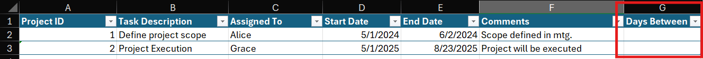
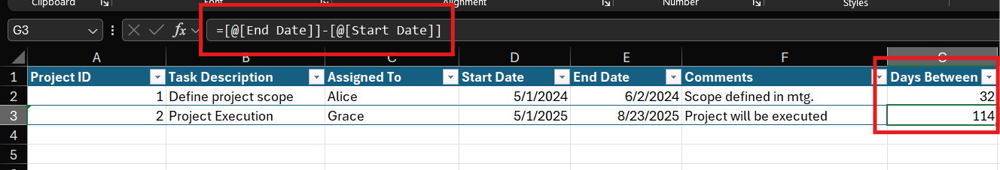
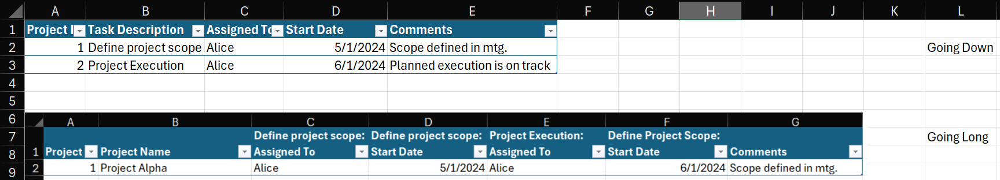

# 02_Project_Tracking_in_Excel
[Back to Overview](./README.md)

### 2.1 Structuring and Managing Data with Excel Tables

One of the first things I learned in project tracking is the importance of keeping data properly structured. Excel provides a dedicated feature called **Tables** (sometimes called “Ctrl+T tables”) that transforms a normal data range into a dynamic and more powerful object.


Creating a table is straightforward: highlight the data range (for example, `A1:G7`), go to **Insert → Table**, and confirm that *My table has headers* is checked. The shortcut **Ctrl+T** achieves the same result. Once created, I also learned that tables can be named (e.g., `Data`) which makes it much easier to reference them in formulas.


I found out that tables bring several advantages compared to raw ranges:

* **Dynamic expansion**: when a new row is added at the bottom, the table automatically grows to include it.
* **Structured references**: formulas can reference columns by name (e.g., `=Data[Task ID]`) instead of cell addresses.
* **On-the-fly calculated columns**: typing a formula in one cell of a new column fills down automatically for the entire column.

Another feature I practiced with was the **Slicer** tool. A slicer provides a clickable filter for categorical fields such as “Assigned To.” After inserting a slicer (via **Insert → Slicer**), I could filter the table interactively, and the table updated in real time.


What I learned here is that tables are more than just formatting: they form the foundation for scalable project tracking.

---

### 2.2 Defining and Monitoring Project Metadata

Once I understood how to structure project data into an Excel Table, the next step was learning **what information is worth tracking**. The instructor emphasized that not every detail belongs in the project management table. Instead, we should focus on a balanced set of fields that provide structure without clutter.



I learned that project metadata can include different types of fields:

* **Numeric fields** like a unique Project ID for identification.
* **Categorical fields** such as “Assigned To” for responsibility.
* **Text fields** for comments or descriptions.
* **Date fields** like Start Date and End Date, which are critical for timeline tracking.

When I added a new column called *Days Between*, Excel automatically treated it as part of the Table. By writing a formula such as:

```excel
=[@End Date]-[@Start Date]
```

I discovered **structured references** in action. Instead of cell addresses (like `C2-B2`), the formula uses field names, and the `@` symbol ensures it applies row by row. Excel then auto-filled the formula down the entire column, instantly calculating the duration for all records.



This reinforced the idea that calculated columns are powerful: they ensure consistency, reduce manual effort, and form the basis for many project metrics (like task duration, schedule variance, or cost per day).

Another important concept I learned was **“going down” versus “going long.”**

* *Going down* means each row represents a project or task, with metadata stored consistently in columns. This approach is usually preferable because it allows all dates, owners, or statuses to be analyzed in a single column.
* *Going long* means one project spans across columns (for example, StartDate1, StartDate2, etc.). While this can work in some cases, it makes analysis harder since similar data gets split across multiple columns.



What I took away from this section is that **good metadata design is essential for analysis**. Choosing the right fields, keeping them consistent, and structuring data to “go down” makes it easier to filter, summarize, and calculate trends later in the project management workflow.

---

[Back to Overview](./README.md)
