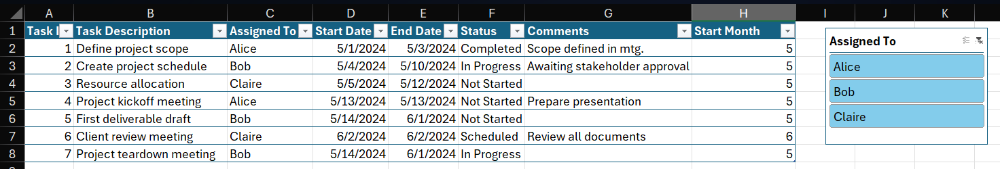

# 02_Project_Tracking_in_Excel
[Back to Overview](./excel-track)

### 2.1 Structuring and Managing Data with Excel Tables

One of the first things I learned in project tracking is the importance of keeping data properly structured. Excel provides a dedicated feature called **Tables** (sometimes called “Ctrl+T tables”) that transforms a normal data range into a dynamic and more powerful object.

Creating a table is straightforward: highlight the data range (for example, `A1:G7`), go to **Insert → Table**, and confirm that *My table has headers* is checked. The shortcut **Ctrl+T** achieves the same result. Once created, I also learned that tables can be named (e.g., `Data`) which makes it much easier to reference them in formulas.

I found out that tables bring several advantages compared to raw ranges:

* **Dynamic expansion**: when a new row is added at the bottom, the table automatically grows to include it.
* **Structured references**: formulas can reference columns by name (e.g., `=Data[Task ID]`) instead of cell addresses.
* **On-the-fly calculated columns**: typing a formula in one cell of a new column fills down automatically for the entire column.

Another feature I practiced with was the **Slicer** tool. A slicer provides a clickable filter for categorical fields such as “Assigned To.” After inserting a slicer (via **Insert → Slicer**), I could filter the table interactively, and the table updated in real time.

What I learned here is that tables are more than just formatting: they form the foundation for scalable project tracking.

---

[Back to Overview](./excel-track)
