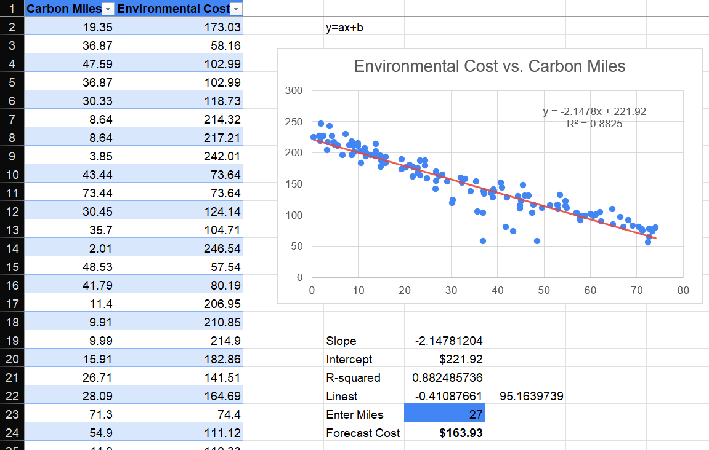
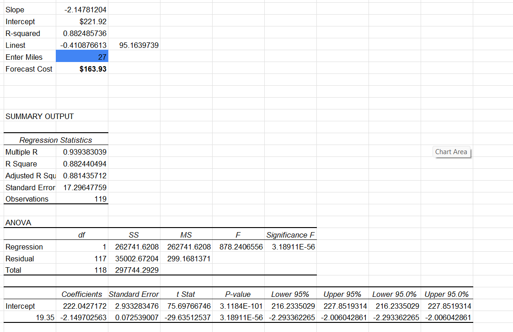

This spreadsheet output represents a linear regression analysis. It shows the relationship between two variables, likely "Carbon Miles" (independent variable, or X) and "Environmental Cost" (dependent variable, or Y), based on a sample size of 119 observations.

### Regression Statistics

* **R-squared (0.882):** This is the coefficient of determination, indicating that approximately **88.2%** of the variance in the "Environmental Cost" can be explained by the "Carbon Miles." This is a very strong fit, suggesting the model is highly predictive.
* **Multiple R (0.939):** This is the correlation coefficient, showing a **strong negative correlation** between the two variables. As "Carbon Miles" increase, "Environmental Cost" tends to decrease.

### Key Coefficients

* **Intercept ($222.04):** This is the predicted "Environmental Cost" when "Carbon Miles" is zero. In this context, it represents a baseline cost unrelated to travel distance.
* **Slope (-2.149):** For every one-unit increase in "Carbon Miles," the "Environmental Cost" is predicted to **decrease by approximately $2.15**. The negative value confirms the inverse relationship shown in the R-squared and Multiple R values.

### Statistical Significance

* **P-value (3.189E-56):** This extremely low value (essentially zero) indicates that the relationship between "Carbon Miles" and "Environmental Cost" is **highly statistically significant**. The probability of observing this relationship by random chance is negligible.
* **t-Stat (-29.63):** The large absolute value of the t-statistic also confirms the **significance** of the slope. It indicates that the slope is many standard errors away from zero, providing strong evidence that "Carbon Miles" is a valid predictor.

### Forecast

* **Forecast Cost ($163.93):** The model predicts that for a value of **27 "Carbon Miles,"** the "Environmental Cost" would be approximately **$163.93**. This is calculated using the regression equation: `Y = -2.149 * 27 + 222.04`.
