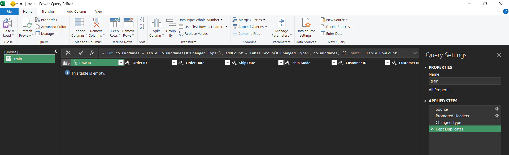
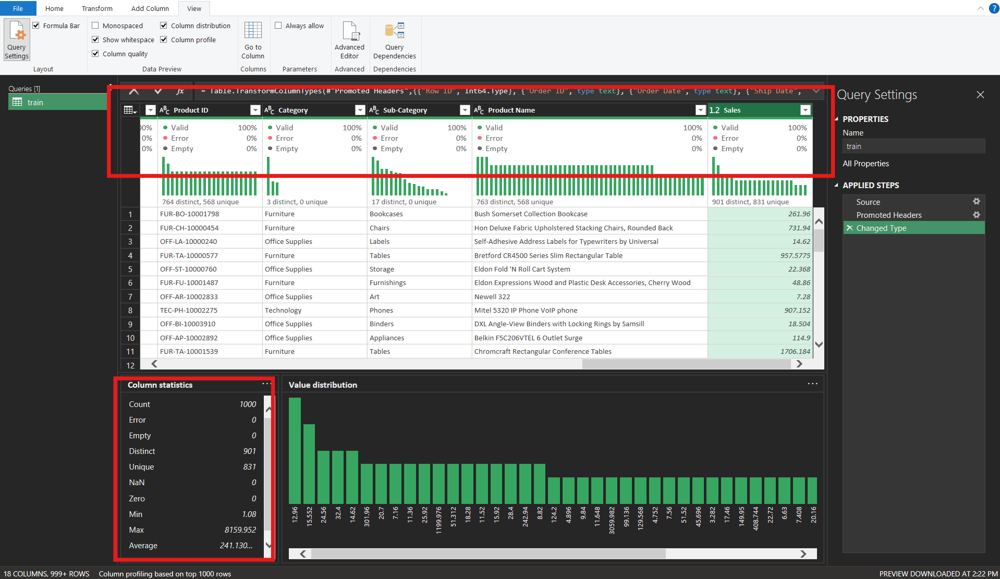
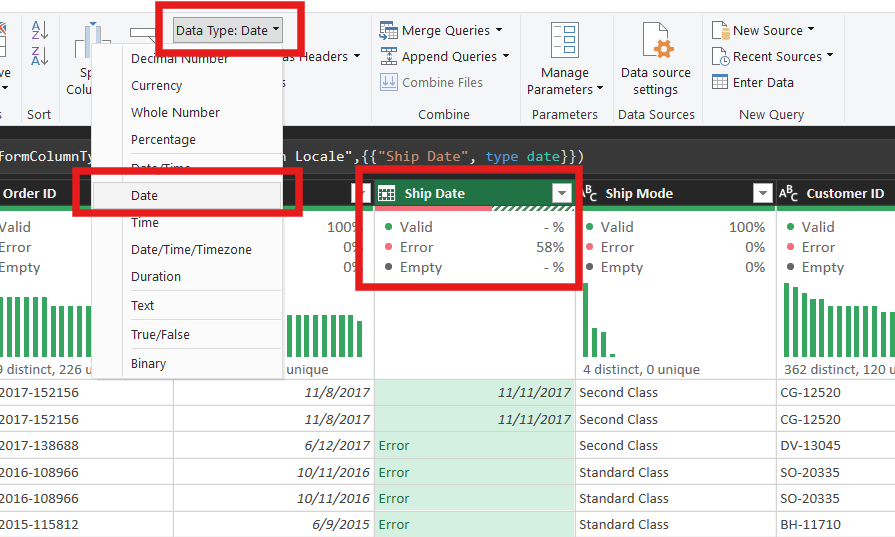
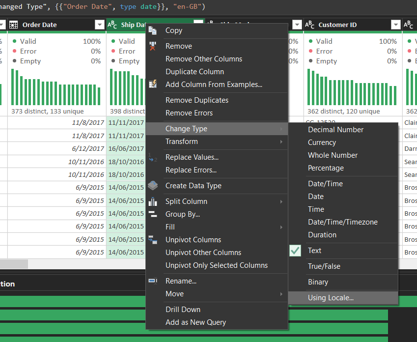
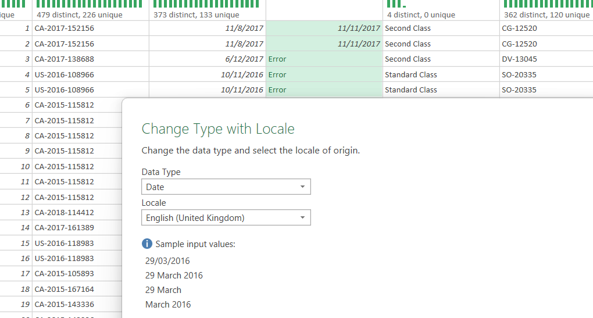
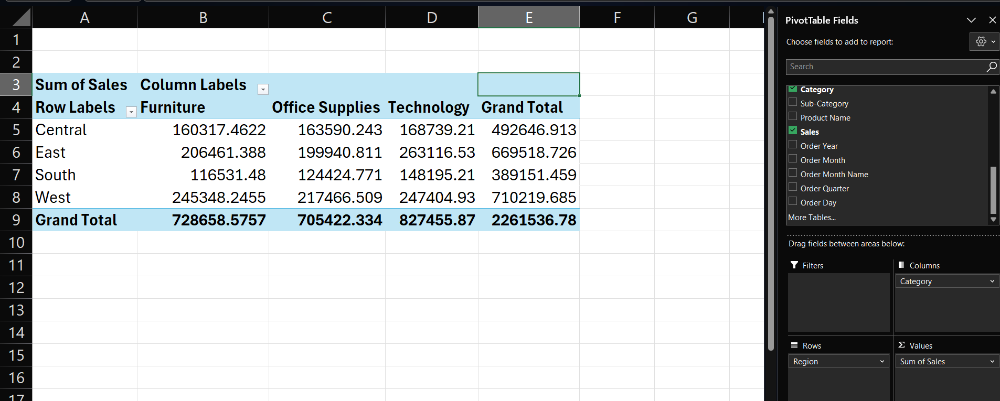
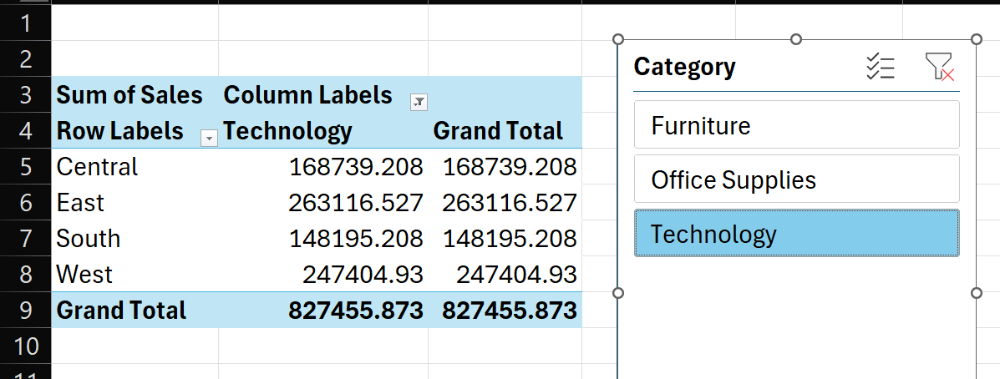
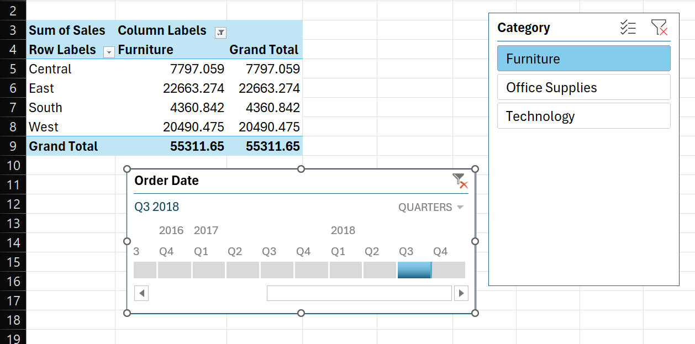

# Retail Sales Performance Dashboard

This project develops an interactive Excel-based dashboard for a mid-size retailer to monitor and analyze sales performance across regions, product categories, and time periods. The goal is to provide leadership with a single-page view, drill-down capability, and automated reporting that replaces a previously manual process requiring several hours each cycle.

### Features and Functionality
- Power Query for data cleaning (removing nulls, formatting dates).
- PivotTables with slicers for interactive filtering.
- Conditional formatting for visual alerts (e.g., red cells for regions below target).
- A KPI summary at the top (Revenue, Growth %, Top Product).

### Data sources
The dataset used for this project is publicly available on Kaggle: [Sales Forecasting Dataset](https://www.kaggle.com/datasets/rohitsahoo/sales-forecasting)

### Deliverable
- Dashboard Tab – A clean, interactive dashboard that consolidates all key views.
- Assumptions Tab – Documentation of cleaning rules, calculated metrics, and business logic applied.
- Raw Data Tab – Original dataset for transparency and reproducibility.
- Insights & Recommendations Slide – A polished one-pager summarizing findings and actionable recommendations.

---

### 1. Data Cleaning Process
#### 1.1 Checking for Duplicates and Missing Values

Duplicates and null values are identified and removed using Power Query.

#### 1.2 Handling Data Types

Directly converting text to date formats can result in errors.

The issue is resolved by using locale-based formatting, ensuring dates are interpreted correctly.
- Right-click the column → Change Type → Using Locale…
  

- Select Date as the data type
- Pick the correct locale (for example, English (United Kingdom) in this case)
  

### 2. PivotTables and Slicers
#### 2.1 The First PivotTable

Drag "Region" to the Rows area, "Category" to the Columns area, and "Sales" to the Values area of the PivotTable Fields pane.

#### 2.2 Slicer

Slicer buttons to filter the Pivot instantly. This PivotTable (without timeline) shows that the total sales for the technology category across the four regions is $827,455.873.

#### 2.3 Timeline for Dates

Use the timeline controls to switch between Year / Quarter / Month / Day and drag the handles to filter. The PivotTable is telling us that the total sales for furniture in Q3 2018 across the four regions shown was $55,311.65.
