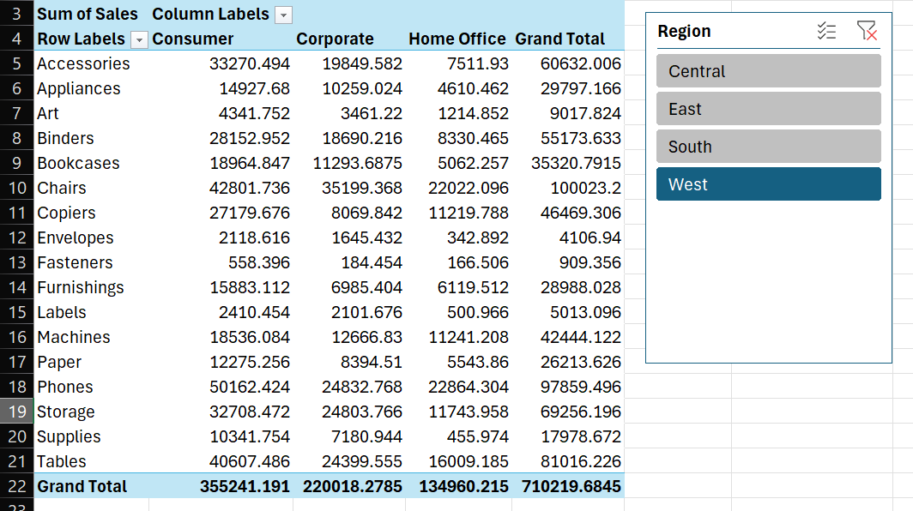
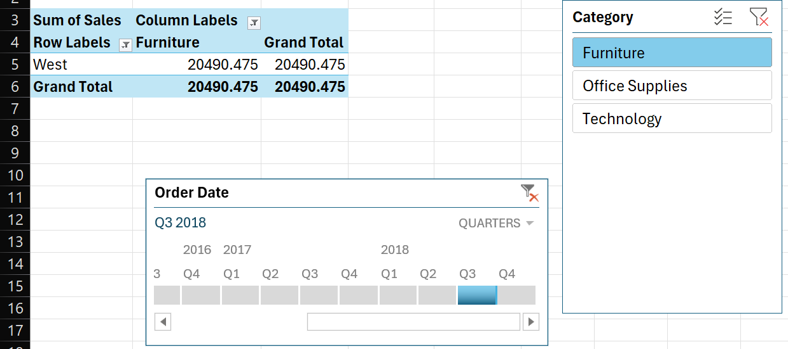
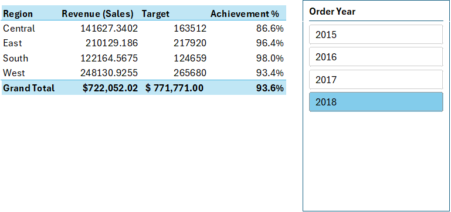
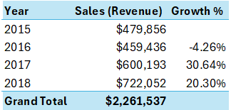
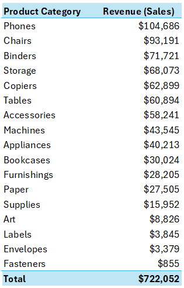
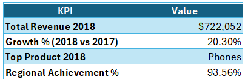

# Retail Sales Performance Dashboard

This project develops an interactive Excel-based dashboard for a mid-size retailer to monitor and analyze sales performance across regions, product categories, and time periods. The goal is to provide leadership with a single-page view, drill-down capability, and automated reporting that replaces a previously manual process requiring several hours each cycle.

### Features and Functionality
- Power Query for data cleaning (removing nulls, formatting dates).
- PivotTables with slicers for interactive filtering.
- Conditional formatting for visual alerts (e.g., red cells for regions below target).
- A KPI summary at the top (Revenue, Growth %, Top Product).

### Data sources
The dataset used for this project is publicly available on Kaggle: [Sales Forecasting Dataset](https://www.kaggle.com/datasets/rohitsahoo/sales-forecasting)

### Deliverable
- Dashboard Tab – A clean, interactive dashboard that consolidates all key views.
- Assumptions Tab – Documentation of cleaning rules, calculated metrics, and business logic applied.
- Raw Data Tab – Original dataset for transparency and reproducibility.
- Insights & Recommendations Slide – A polished one-pager summarizing findings and actionable recommendations.

---

### 1. Data Cleaning Process
#### 1.1 Checking for Duplicates and Missing Values

Duplicates and null values are identified and removed using Power Query.

#### 1.2 Handling Data Types

Directly converting text to date formats can result in errors.

The issue is resolved by using locale-based formatting, ensuring dates are interpreted correctly.
- Right-click the column → Change Type → Using Locale…
  

- Select Date as the data type
- Pick the correct locale (for example, English (United Kingdom) in this case)
  

### 2. PivotTables and Slicers
#### 2.1 The First PivotTable

Drag "Region" to the Rows area, "Category" to the Columns area, and "Sales" to the Values area of the PivotTable Fields pane.

#### 2.2 Slicer

Slicer buttons to filter the Pivot instantly. This PivotTable (without timeline) shows that the total sales for the technology category across the four regions is $827,455.873.

#### 2.3 Timeline for Dates

Use the timeline controls to switch between Year / Quarter / Month / Day and drag the handles to filter. The PivotTable is telling us that the total sales for furniture in Q3 2018 across the four regions shown was $55,311.65.

#### 2.4 Unified Report Filtering

A single slicer can be connected to multiple PivotTables or charts, enabling synchronized data filtering across various visualizations. This is accomplished by right-clicking the slicer and selecting "Report Connections" to link the desired tables and charts. The resulting report provides a cohesive and interactive data analysis experience.

### 3. Conditional Formatting

To improve interpretability, conditional formatting was applied on the **Achievement %** column within the regional performance pivot. This allows for immediate visual alerts when a region fails to meet its target. In this dataset, all regions achieved or exceeded their targets, so no red alerts were triggered. The absence of highlighted cells itself conveys that performance across regions is satisfactory.

  

### 4. A KPI Summary

A consolidated KPI summary was developed to provide a one-page view of performance across regions, years, and product categories.

* **Regional Performance:** The pivot table compares sales against targets, with an Achievement % column to highlight underperforming regions.
  *Insight: All regions slightly exceeded their targets except the West, which achieved 91.9% of its goal.*

    

* **Yearly Performance:** The pivot table tracks total sales per year and calculates growth rates, enabling quick identification of expansion or decline trends.
  *Insight: After a contraction in 2016 (-4.26%), sales rebounded strongly with 30.6% growth in 2017 and continued with 20.3% growth in 2018.*

    

* **Product Performance:** Sales are broken down by product category, with a slicer for year-based filtering, making the dashboard interactive and adaptable for different analysis horizons.
  *Insight: Phones, Chairs, and Binders consistently appear as top-performing categories, together driving a significant share of total revenue.*

    

* **KPI Cards:** At the top of the dashboard, KPI cards highlight the most important metrics such as Total Revenue, Growth %, and Top Product. These provide a quick executive-level overview before diving into detailed tables.
  *Insight: Total revenue reached \$722K in 2018, with Chairs and Phones competing as the top product categories.*

    

---

**Executive Summary:**
Overall, the business demonstrated steady revenue growth from 2016 to 2018, with most regions meeting or exceeding targets and Phones and Chairs emerging as consistent top performers, indicating a healthy trajectory supported by both geographic and product diversification.
